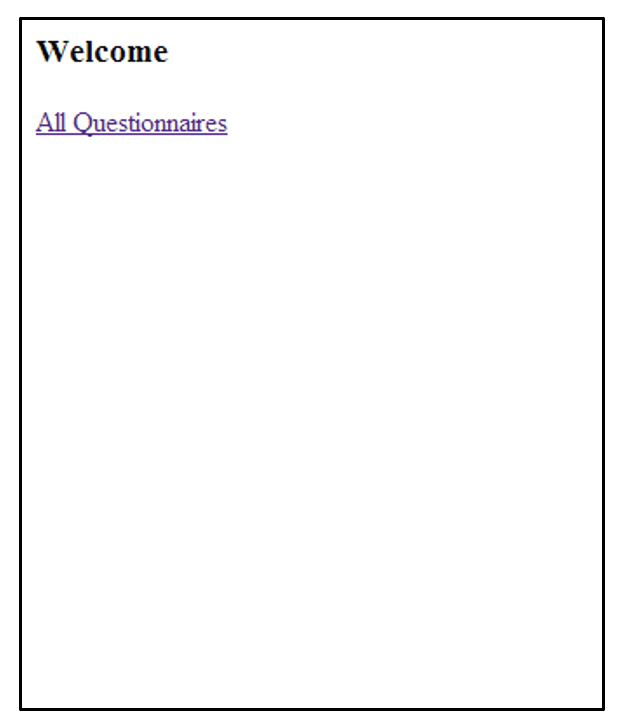
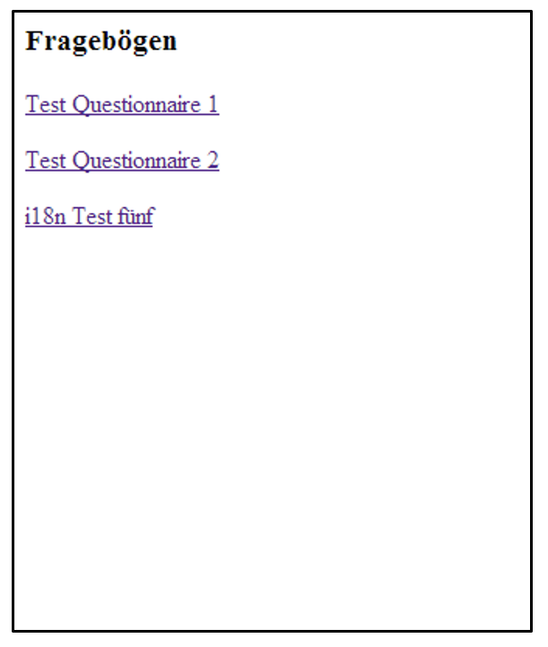

# Arbeitsblatt 1.2: Das Servlet 

## Ziele
- Repetition der im Modul "Verteilte Systeme" bereits behandelten Servlet Komponente.
- Sie kennen die Servlet Komponente und deren Verwendungszweck.
- Sie können Servlet als Basiskomponenten der Java Servlet Technologie einsetzen.

## Ausgangslage
Das Arbeitsblatt 1 ist korrekt gelöst. Ein Tomcat Server ist auf Ihrem Rechner installiert und lauffähig.

## Vorbereitung
Laden Sie die Lektion 01 als zip-File auf Ihren Computer und entpacken Sie das zip-File. Verschieben/kopieren Sie den Ordner `01-*` an einen Ort Ihrer Wahl.

## Aufgabe 1: Webapplikation _flashcard_basic_ installieren
Die Webapplikation _flashcard-basic_ im Ordner `01-*/ab1.2/initial` ist ein Gradle Projekt. Importieren Sie dieses Projekt als "Gradle Project" - wird z.T. automatisch erkannt - in Ihre IDE und studieren Sie den Code.

Nutzen Sie das Terminal Ihrer IDE. Erstellen Sie nun mit dem Befehl:

```shell
./gradlew war
```

das entsprechende war-File `flashcard-basic.war`. Das File wird im Ordner `build/libs` abgelegt.

Kopieren Sie dieses war-File in den Ordner `$TOMCAT_HOME/webapps` Ihrer Tomcat-Installation. Starten Sie Tomcat mit:

```shell
./bin/catalina.sh run
```

Mit der URL auf http://localhost:8080/flashcard-basic/app müssen Sie nun den Output gemäss Abbildung 1 erhalten.



Abbildung 1: Startseite

Sie können sich nun durch die Applikation klicken und so zu den einfachen Screens gemäss Abbildung 2 gelangen.



Abbildung 2: Liste der vorhandenen Fragebögen

## Aufgabe 2: Fragen bearbeiten
Beantworten Sie folgende Fragen:

1. Zeichnen Sie die Struktur der Webapplikation _flashcard-basic_ im Ordner `$TOMCAT_HOME/webapps/flashcard-basic` auf?
2.	Was ist die Funktion des Files `web.xml`?
3.	Was bewirkt der Eintrag `<servlet-mapping>` in File `web.xml`?
4.	Kann man den Eintrag `<servlet ...` ohne Konsequenzen auf das Laufzeitverhalten der Webapplikation aus dem File `web.xml` löschen?
5.	Was ist ein _ServletContext_?
6.	Welche Response erhalten Sie auf http://localhost:8080/flashcard-basic/smiley.png? Warum?
7.	Analysieren Sie das Servlet _BasicServlet_, indem Sie zu jeder nummerierten Zeile in Listing 1 eine kurze Erklärung geben.


```
public class BasicServlet extends HttpServlet {	#1
	...
	protected void doGet(HttpServletRequest request,
			HttpServletResponse response) throws ServletException, IOException {	#2
		response.setContentType("text/html; charset=utf-8");	#3

		String[] pathElements = request.getRequestURI().split("/");
		if (isLastPathElementQuestionnaires(pathElements)) {	#4
			handleQuestionnairesRequest(request, response);
		} else {
			handleIndexRequest(request, response);
		}
	}

	private boolean isLastPathElementQuestionnaires(String[] pathElements) {
		String last = pathElements[pathElements.length-1];
		return last.equals("questionnaires");
	}

	...

	private void handleIndexRequest(HttpServletRequest request,
			HttpServletResponse response) throws IOException {
		PrintWriter writer = response.getWriter();	#5
		writer.append("<html><head><title>Example</title></head><body>");
		writer.append("<h3>Welcome</h3>");
		String url = request.getContextPath()+request.getServletPath();
		writer.append("<p><a href='" + response.encodeURL(url) + "/questionnaires'>All Questionnaires</a></p>");
		writer.append("</body></html>");
	}
	
	@Override
	public void init(ServletConfig config) throws ServletException {	#6
		super.init(config);
		questionnaireRepository = QuestionnaireInitializer().initRepoWithTestData();	#7
	}
}
```

Listing 1: Auszug aus _BasicServlet_