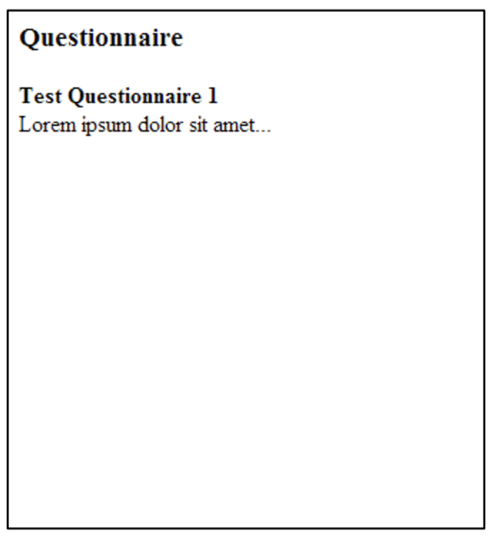

# Arbeitsblatt 1.3: BasicServlet erweitern

## Ziele
- Die Webapplikation kann weitere URLs korrekt behandeln.

## Ausgangslage
Das Arbeitsblatt 1.2 ist korrekt gelöst. Die Webapplikation ist auf Ihrem Rechner installiert und lauffähig.

Die URL http://localhost:8080/flashcard-basic/app/questionnaires/1 wird von der Webapplikation noch nicht korrekt behandelt. Sie führt immer zurück zur Startseite - anstatt die Details des entsprechenden Fragebogens (hier mit der ID=1) anzuzeigen.

## Aufgabe 1: BasicServlet ergänzen
Ergänzen Sie das BasicServlet so, dass ein Request auf 

`http://localhost:8080/flashcard-basic/app/questionnaires/{id}` 


korrekt behandelt wird und z.B. für id=1 zu einer Seite führt, wie in Abbildung 1 gezeigt.



Abbildung 1: Detailansicht eines Fragebogens

Orientieren Sie sich an folgender Struktur der Methode `doGet()` und ergänzen Sie diese entsprechend.

```
...
if (isLastPathElementQuestionnaires(pathElements)) {	
	handleQuestionnairesRequest(request, response);  // handle "/questionnaires" request
} else {
	handleIndexRequest(request, response);   // handle "/" request (default)
}
...
```

Testen Sie auch die anderen Detailansichten.

Bemerkungen:
- Über die Klasse `QuestionnaireInitializer` werden ein paar Fragebögen bei der Initialisierung der Webapplikation instanziert.

## Aufgabe 2: Verbesserungspotenzial erkennen
Studieren Sie Ihre Lösung, in dem Sie sich Überlegungen zu folgenden Fragen machen:
- Welcher Code wird bei jedem Request abgearbeitet?
- Welcher Code ist spezifisch zu einem entsprechenden Request? 
- Was würden Sie in ein Framework auslagern, z.B. weil es bei jedem Request verwendet wird und/oder weil der Entwickler immer das "Gleiche" implementieren muss.
- Was gefällt Ihnen aus Informatiksicht an dieser ersten Applikation? **Was sollte aber unbedingt verbessert werden?**
