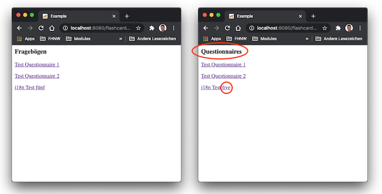

# Lektion 2: Servlet Komponenten

## Einleitung

In dieser Lektion erhalten Sie zusätzliche Informationen zur Komponente *Servlet* wie:

* Servlet-Container
* ServletRequest und ServletResponse
* ServletContext
* Servlet Lifecycle

Neu werden zwei weitere Basiskomponenten der Servlet-Technologie eingeführt:

* Filter
* Listener

Sie kennen nach dieser Lektion die elementaren Bausteine, die in jeder Java Webapplikation zum Einsatz kommen und die von jedem Web Framework, z.B. auch von [Spring MVC](https://docs.spring.io/spring/docs/current/spring-framework-reference/web.html#mvc) intensiv genutzt werden. Es ist deshalb wichtig, dass Sie ein gutes Verständnis von diesen Basiskomponenten haben, um auch die Funktionsweise solcher Frameworks verstehen zu können.

Sie sollten ein fundiertes Verständnis der gesamten Verarbeitungskette eines HTTP Requests (Browser-Server-Browser) bei einer einfachen Java Webapplikation aufbauen, um folgende Fragen beantworten zu können:

* Welche Rolle spielt das Servlet?
* Welche Rolle spielt der Filter?
* Welche Rolle spielt der Listener?
* Wie wird eine URL verarbeitet, so dass Sie schlussendlich beim Servlet - dem Endpoint - ankommt?

## Arbeitsauftrag

Zur Vorbereitung und Erarbeitung der Theorie lesen Sie sich in das aktuelle Thema ein, mit 

* der [Einführung](#einführung) und
* den Unterrichtsfolien [pdf](docs/Servlet%20Komponenten.pdf), [mp4](https://tube.switch.ch/videos/zPvJagKvvL)

Anschliessend vertiefen Sie die Theorie mit folgenden Arbeitsblättern:

* [Arbeitsblatt AB2.1](./ab2.1/README.md)  
    In der **Aufgabe 1** implementieren Sie einen _Filter_, der die URLs jedes HTTP Requests aufzeichnen soll. Mit diesem Monitoring erhalten Sie einen Überblick über die verwendeten URLs, also welche Webpage in Ihrer Applikation am meisten aufgerufen wird.

    In der **Aufgabe 2** implementieren Sie einen _Listener_. Sie wollen Ihre Webapplikation in zwei verschiedenen Mode starten können:

    1. Mode "test": Zu Testzwecken wird das `QuestionnaireRepository` beim Starten der Webapplikation mit mehreren Entitäten "Questionnaire" gefüllt.
    2. Mode "productive": Das `QuestionnaireRepository` ist beim Starten der Webapplikation leer.

* [Arbeitsblatt AB2.2](./ab2.2/README.md)  
    In diesem Arbeitsblatt lernen Sie den Umgang mit den Wrapper Klassen. Sie sollen einen [HttpServletResponseWrapper](https://jakarta.ee/specifications/platform/11/apidocs/jakarta/servlet/http/httpservletresponsewrapper) einsetzen, um die Response, die das Servlet generiert, zu bearbeiten. Konkret sollen Sie in einem Filter alle deutschen Wörter in der Response auf Englisch übersetzen.

    Abbildung 1 zeigt ein Beispiel. 

    

    Abbildung 1: Beispiel der Englisch-Übersetzung auf der Übersichtsseite

## Einführung

Lesen Sie die [Zusammenfassung](SUMMARY.md) zu den verschiedenen Komponenten der Servlet-Spezifikation.

Hier ein paar Links aus dem Internet, die nützlich und aktuell sind:

* [Filter](https://jakarta.ee/specifications/servlet/6.1/jakarta-servlet-spec-6.1.html#what-is-a-filter)
* [Application Lifecycle Events](https://jakarta.ee/specifications/servlet/6.1/jakarta-servlet-spec-6.1.html#application-lifecycle-events)