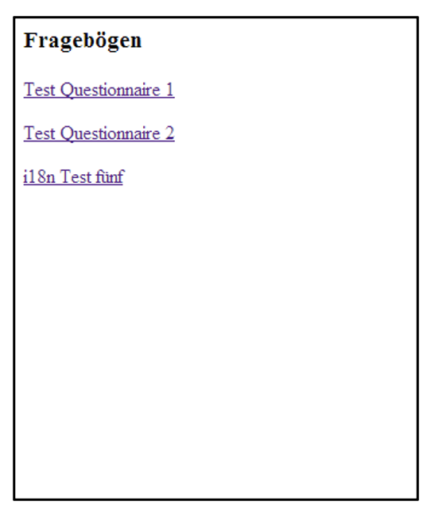

# Arbeitsblatt 2.2: English-Translator als i18n Filter entwickeln 

## Ziel

- Sie können mittels Filter die HTTPResponse vom Servlet modifizieren.

## Ausgangslage

Das Arbeitsblatt 2.1 ist korrekt gelöst und lauffähig.

## Aufgabe 1: Filter _I18NFilter_ implementieren

Die Applikation aus AB2.1 soll wie folgt erweitert werden.

Der Request auf http://localhost:8080/flashcard-basic/questionnaires führt zur Response in Abbildung 1.



Abbildung 1: Response auf `http://localhost:8080/flashcard-basic/questionnaires`

Wie in Abbildung 1 zu sehen, ist die Sprache der Antwort nicht einheitlich. Mit einem Filter soll nun eine einfache Internationalisierung realisiert werden. Ein entsprechendes Sprachfile soll z.B. folgende Einträge haben:

```text
Frageb&ouml;gen: Questionnaires
f&uumlnf: five
```

Listing 1: Beispieleinträge in einem Sprachfile, um Deutsch in Englisch zu übersetzen

Ausgehend von einer Sprachdatei mit Key/Value Einträgen (siehe Listing 1) sollen Sie den Filter `I18NFilter` implementieren, der folgende Logik umsetzt:

- Name des Sprachfiles auslesen:  
Dateiname des Sprachfile aus dem `ServletContext` lesen

- Sprachfile laden:  
i18n-Messages aus Sprachfile laden und in einer Key/Value Liste ablegen

- Deutsche Wörter übersetzen:  
Servlet Response im Filter abfangen, Response zeilenweise untersuchen, ob "Key" vorhanden und falls existent, diesen mit entsprechenden "Value" ersetzen.

- Übersetzte Response generieren:  
Übersetzte Response an Browser weiterleiten

__Tipps__:

- Arbeiten Sie mit Annotationen.

- Um die Servlet-Response bearbeiten zu können, muss die Klasse `HttpServletResponseWrapper` eingesetzt werden. Suchen Sie im Internet (z.B. auf StackOverflow) nach einem entsprechenden Beispiel.

- Der Name des Sprachfiles soll als init-Parameter im File `web.xml` konfiguriert werden können. Beachten Sie das Error-Handling, falls dieser Wert nicht gesetzt ist. Setzen Sie dann einen Default-Filename wie z.B. `i18n.properties`.

- Legen Sie die Sprachdatei auf den Classpath z.B. in `src/main/resources`. Dann kann der Zugriff über `Thread.currentThread().getContextClassLoader().getResourceAsStream(filename)` erfolgen.

- Das Sprachfile soll bei der Initialisierung des entsprechenden Filters geladen werden.

- Vergessen Sie das Filter-Mapping nicht.
